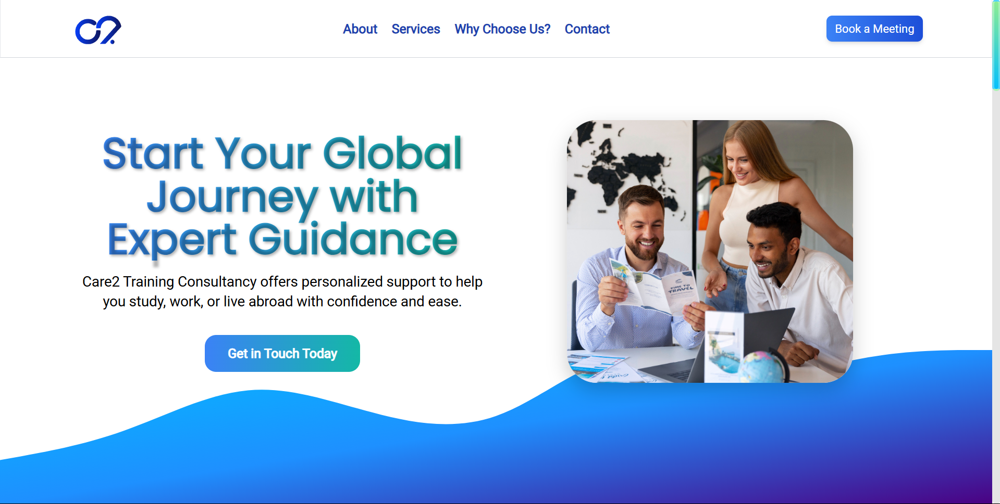

# Care2 Training Consultancy Landing Page

## Project Overview

This project is the landing page for **Care2 Training Consultancy**, a service that offers support for students, professionals, and travelers wishing to study, work, or live abroad. The landing page is designed with the goal of attracting users who need guidance in visa applications, finding study opportunities abroad, and exploring work abroad placements.

The page is visually appealing, fully responsive, and optimized for both performance and SEO, providing a smooth and intuitive user experience.

---

## Features

### Hero Section

- **Headline**: A creative headline that clearly communicates the value of the consultancy services.
- **Subheading**: A brief description explaining what the consultancy offers, such as visa assistance, study abroad opportunities, and work abroad placements.
- **Call-to-Action Button**: Encourages users to get in touch or learn more about services.
- **Background Image & Animation**: Visuals that represent students, professionals, and places people aspire to study or work in.

### About Us Section

- A brief introduction to the consultancy, explaining the expertise and experience that Care2 Training Consultancy brings to its clients.

### Our Services Section

- **Service Cards**: Displaying the three main services offered by the consultancy: Student Visa Assistance, Work Abroad Opportunities, and Consultancy for Living Abroad.
- **Learn More Buttons**: For users to explore the details of each service.

### Why Choose Us Section

- **Benefits**: Clear, concise bullet points highlighting why users should choose Care2 Training Consultancy, along with our achievement so far.

### Contact Form Section

- Used Google Map to show the location of the organization for better trust.
- A simple contact form to collect user inquiries with fields for Name, Email, and Message.

### Footer Section

- **Contact Details**: Address, phone number, email.
- **Social Media Links**: Icons for social media profiles (Facebook, Instagram, Linkedin, X(Twitter)).
- **Legal Pages**: Links to the Privacy Policy and Terms of Service.

### Prerequisites

To run the project locally, you need the following installed:

- [Node.js](https://nodejs.org/) (for running the React application)
- [npm](https://www.npmjs.com/) (for managing dependencies)

### Installation

1. **Clone the Repository**:

   ```bash
   git clone https://github.com/jobairalsarkar1/care2.git
   cd care2

   npm install

   npm start
   ```
